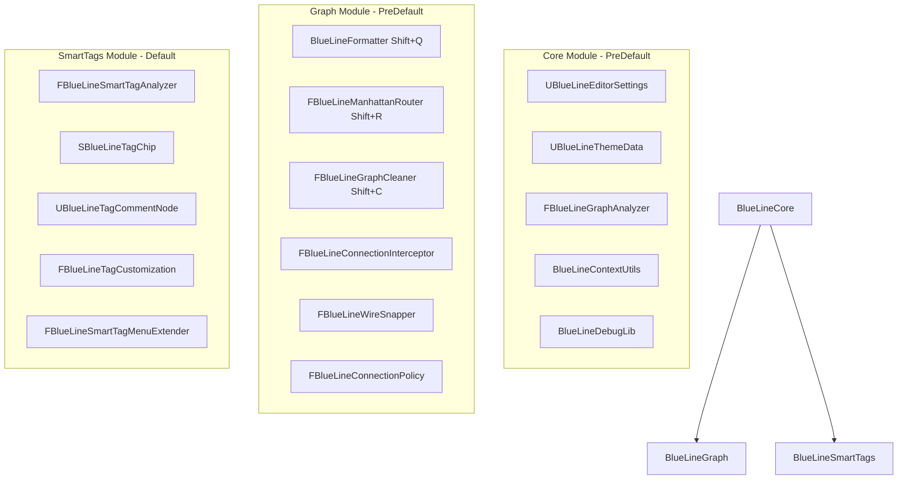

# BlueLine (Core)
### Clean Wires. Shared Tags. Pure Logic.

    [](https://www.youtube.com/@agregori) [](https://ko-fi.com/C0C616ULD4)

[Example video 1](https://www.youtube.com/watch?v=qFOMJrigYo0) <br>
[Update video 1](https://www.youtube.com/watch?v=pUQSMOLOd9c) <br>
[Update video 2](https://www.youtube.com/watch?v=ZY527-SltrM) <br>
[Update video 3](https://www.youtube.com/watch?v=PtDSXUfajH8) <br>
[Discord support](https://discord.gg/nqYQ5mtmHb) <br>

*[This repository deals with advanced bypasses of standard Unreal C++ & Blueprint bottlenecks. 🟢 Currently available for B2B consulting and remote contract/Co-Dev integration (CET Timezone). [Contact form.](https://gregorigin.com/contact.html)]*


<br><br><br>

**BlueLine Core (v1.2.0)** is the lightweight, modular, open-source Blueprint productivity & wire-organization plugin for Unreal Engine 5.5 - 5.8+. It solves the "Spaghetti Code" problem in Blueprints by providing non-destructive selection formatting, orthogonal Manhattan rerouting with centered knots, genetic-algorithm graph cleaning, magnetic wire snapping, and semantic smart tag categorization.


---

### 🌟 Feature Comparison: Core OSS vs Full Fab Edition

| Feature / Capability | <b>BlueLine Core (Open Source - MIT)</b> | <b>[BlueLine Pro on Fab](https://www.fab.com/listings/e63e4083-675d-44ad-a20e-487ceea6ffb1) (Commercial)</b> |
| :--- | :---: | :---: |
| **Distribution & License** | Source Code (MIT) | Precompiled Binaries + Source (Epic Fab) |
| **Engine Support** | UE 5.5, 5.6, 5.7, 5.8+ | UE 5.5, 5.6, 5.7, 5.8+ (Regular updates) |
| **Magnet Auto-Format (`Shift+Q`)** | ✅ Included | ✅ Included |
| **Manhattan Wire Rigidify (`Shift+R`)** | ✅ Included (Centered Knots) | ✅ Included (Centered Knots) |
| **Genetic Graph Cleaner (`Shift+C`)** | ✅ Included (GA Crossing Optimizer) | ✅ Included (GA Crossing Optimizer) |
| **Smart Semantic Auto-Tagging (`Shift+T`)** | ✅ Included (Knot Traversal) | ✅ Included (Knot Traversal) |
| **Magnetic Wire Pin Snapping** | ✅ Included | ✅ Included |
| **Interactive Wire Style Cycling (`Shift+Alt+W`)** | ✅ Included | ✅ Included |
| **Theme System & Data Asset Colors** | ✅ Included | ✅ Included |
| **Runtime Debug Visualizer Library** | ✅ Included | ✅ Included |
| **Context Menu & Messy Demo Spawner** | ✅ Included | ✅ Included |
| **Automated Core Unit Tests** | ✅ Included (10 Tests) | ✅ Included (16 Tests) |
| **Level Viewport Radial Menu (`Alt+X`)** | ❌ Commercial only | ✅ Included (Pivot & Cursor Snapping) |
| **Material & Actor Scope Selection** | ❌ Commercial only | ✅ Included |
| **Blueprint Subsystem Extractor (`Shift+B`)** | ❌ Commercial only | ✅ Included |
| **Blueprint Graph Exporter to Text (`Shift+E`)** | ❌ Commercial only | ✅ Included |
| **Quick Bookmarks System (`Alt+1..9`, `Alt+Shift+1..9`)** | ❌ Commercial only | ✅ Included |
| **Dockable Snippet Tab & Palette (`Shift+S / Shift+I`)** | ❌ Commercial only | ✅ Included |
| **Static Blueprint Linter & CI/CD Commandlet (`Shift+L`)** | ❌ Commercial only | ✅ Included |
| **Zero-Latency Wireless Nodes (`Decl` / `Use`)** | ❌ Commercial only | ✅ Included |
| **Interactive Setup Wizard** | ❌ Commercial only | ✅ Included |
| **Dedicated Epic Marketplace Support** | GitHub Issues | Direct Email & Discord Priority Support |

---

## ⚡ Core Hotkeys & Shortcuts

| Hotkey | Action | Description |
| :--- | :--- | :--- |
| **Shift + Q** | **Magnet Align** | Non-destructive selection format: aligns selected nodes to the grid relative to input connections without moving unselected logic. |
| **Shift + R** | **Rigidify Wires** | Inserts grid-snapped Knots (Reroute Nodes) with sub-pixel centering `(X-16, Y-16)` to turn curved wires into clean 90° Manhattan lines. |
| **Shift + C** | **Clean Graph** | Global topological layout pass using Genetic Algorithm crossing reduction, pure-node flow, and comment box position locking. |
| **Shift + T** | **Auto-Tag** | Scans cluster semantics across knots (Combat, Movement, AI, Data) and wraps nodes in colored `UBlueLineTagCommentNode` boxes. |
| **Shift + Alt + W** | **Toggle Wire Style** | Cycles dynamically through Curved (Vanilla), Manhattan, Circuit Board, and Hybrid wire rendering styles. |

---

## 🏛️ BlueLine Core Pillars

### 1. 🔀 Pathfinding & Orthogonal Rerouting (Clean Wires)
* **Manhattan Routing (`Shift+R`):** Inserts Knot (Reroute) nodes at calculated 90° bends with backward-loop clearance and precise pin centering `(CornerX - 16, CornerY - 16)`.
* **Staggered Parallel Connections:** Multiple connections between the same node pair receive staggered bend offsets to prevent wire overlap.
* **Auto-Routing Interceptor:** Automatically routes newly created connections on the fly using deterministic object-ID hashing.
* **Magnetic Wire Snapping:** Automatically detects nearby compatible pins during wire drag operations and snaps cleanly into position.

### 2. 🏷️ Smart Tag System (Visual Semantics)
* **Property Customization:** Replaces plain text `FGameplayTag` entries with styled, colored chips.
* **Semantic Analysis Engine:** Multi-factored heuristic analyzer that inspects function calls, variable names, and pin topology.
* **Auto-Tagging (`Shift+T`):** Clusters connected nodes (traversing through reroute knots) and generates labeled, semantically tinted `UBlueLineTagCommentNode` boxes.
* **Built-in Messy Demo Spawner:** Right-click context menu action to spawn benchmark logic chains for test-driving formatting and tagging tools.

### 3. 🧬 Evolutionary Graph Cleaner (`Shift+C`)
* **Hierarchical Organization:** Uses topological BFS ranking to structure chaotic graph execution flows.
* **Genetic Algorithm Crossing Minimization:** Re-orders parallel execution chains to drastically reduce visual line overlaps.
* **Pure Node Placement:** Places pure math/data nodes cleanly to the left of their consumer execution nodes.
* **Comment Box Preservation:** Preserves existing comment boxes and their encapsulated node positions.
* **Safe Scoped Transactions:** Every operation is registered in Unreal's Undo/Redo buffer (`Ctrl+Z` supported).

### 4. 🎨 Shared Team Themes & Runtime Debugging
* **`UBlueLineThemeData`:** Centralized Data Asset stored in `/Game/BlueLine/` so whole teams share color palettes without local config discrepancies.
* **`UBlueLineDebugLib`:** Static C++ and Blueprint library that renders colored 3D floating debug text matching your editor tag themes in PIE and runtime builds.

---

## 🧪 Automated Testing Suite

BlueLine Core ships with a comprehensive set of automated unit and regression tests:

* `BlueLine.Graph.Analyzer.BasicMetrics`: Verifies node counts, connection tracking, and complexity metrics.
* `BlueLine.Graph.Analyzer.ClusterDetection`: Verifies BFS graph partitioning across isolated logic blocks.
* `BlueLine.Graph.Analyzer.BoundsCalculation`: Validates cluster boundary box computation with Knot 32x32 bounding.
* `BlueLine.Graph.Analyzer.WireCrossings`: Tests geometric intersection math with shared-endpoint exclusion.
* `BlueLine.Graph.Formatter.ExecAlignment`: Verifies that `Shift+Q` pushes downstream nodes and aligns execution pin Y coordinates.
* `BlueLine.Graph.Cleaner.CyclesAndComments`: Ensures directed cyclic graphs and comment boxes are handled safely without infinite loops.
* `BlueLine.Graph.Cleaner.PureNodeFlow`: Confirms pure nodes flow to the left of consumers and exec lines remain horizontal.
* `BlueLine.Graph.Routing.KnotCenteringAndPinPos`: Validates `(NodePosX + 16, NodePosY + 16)` knot centering math.
* `BlueLine.SmartTags.AutoTag.PersistsMetadata`: Confirms semantic tags persist on comment nodes.
* `BlueLine.SmartTags.AutoTag.RespectsBlueprintColorEditSetting`: Verifies color editing settings compliance.

Run all tests inside Unreal Editor via **Window > Developer Tools > Session Frontend > Automation** or through RunUAT.

---

## 🏗️ Installation & Setup

1. **Clone to Plugins:** Clone this repository directly into your project's `Plugins` directory:
   ```bash
   git clone https://github.com/gregorik/BlueLine.git YourProject/Plugins/BlueLineCore
   ```
2. **Generate Project Files:** Right-click your `.uproject` file and select **Generate Visual Studio Project Files**.
3. **Compile:** Open the solution in Visual Studio / Rider and build for `Development Editor`.
4. **Enable:** In Unreal Engine, navigate to **Edit > Plugins** and confirm **BlueLine Core** is enabled.

---

## 🧩 Architecture



---

## 📄 License

This open-source core edition of BlueLine is released under the **MIT License**.

For the full commercial edition with Level Editor Pie Menu, Subsystem Extractor, Graph Exporter, Bookmarks, Snippets, Static Linter, and Wireless Nodes, visit [Fab](https://www.fab.com/listings/e63e4083-675d-44ad-a20e-487ceea6ffb1).
