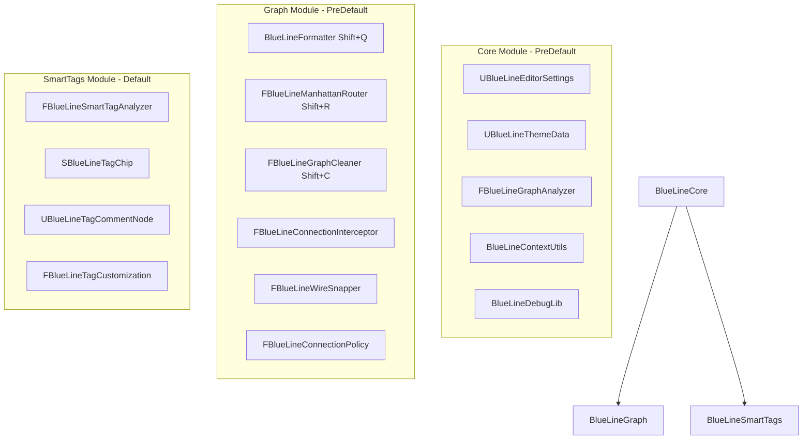

# BlueLine (Core)
### Clean Wires. Shared Tags. Pure Logic.

    [](https://www.youtube.com/@agregori) [](https://ko-fi.com/C0C616ULD4)

[Example video 1](https://www.youtube.com/watch?v=qFOMJrigYo0) <br>
[Update video 1](https://www.youtube.com/watch?v=pUQSMOLOd9c) <br>
[Update video 2](https://www.youtube.com/watch?v=ZY527-SltrM) <br>
[Update video 3](https://www.youtube.com/watch?v=PtDSXUfajH8) <br>
[Discord support](https://discord.gg/nqYQ5mtmHb) <br>

*[This repository deals with advanced bypasses of standard Unreal C++ & Blueprint bottlenecks. 🟢 Currently available for B2B consulting and remote contract/Co-Dev integration (CET Timezone). [Contact form.](https://gregorigin.com/contact.html)]*


<br><br><br>

**BlueLine Core** is the lightweight, modular, open-source Blueprint productivity & wire-organization plugin for Unreal Engine 5.5 - 5.7+. It solves the "Spaghetti Code" problem in Blueprints by providing non-destructive selection formatting, orthogonal Manhattan rerouting, graph cleaning, magnetic wire snapping, and semantic tag categorization.


---

### 🌟 Feature Comparison: Core OSS vs Full Fab Edition

| Feature / Capability | <b>BlueLine Core (Open Source - MIT)</b> | <b>[BlueLine Pro on Fab](https://www.fab.com/listings/e63e4083-675d-44ad-a20e-487ceea6ffb1) (Commercial)</b> |
| :--- | :---: | :---: |
| **Distribution & License** | Source Code (MIT) | Precompiled Binaries + Source (Epic Fab) |
| **Engine Support** | UE 5.5, 5.6, 5.7+ | UE 5.5, 5.6, 5.7+ (Regular updates) |
| **Magnet Auto-Format (`Shift+Q`)** | ✅ Included | ✅ Included |
| **Manhattan Wire Rigidify (`Shift+R`)** | ✅ Included | ✅ Included |
| **Genetic Graph Cleaner (`Shift+C`)** | ✅ Included | ✅ Included |
| **Smart Semantic Auto-Tagging (`Shift+T`)** | ✅ Included | ✅ Included |
| **Magnetic Wire Pin Snapping** | ✅ Included | ✅ Included |
| **Interactive Wire Style Cycling (`Shift+W`)** | ✅ Included | ✅ Included |
| **Theme System & Data Asset Colors** | ✅ Included | ✅ Included |
| **Runtime Debug Visualizer Library** | ✅ Included | ✅ Included |
| **Level Viewport Pie Menu (`Alt+X`)** | ❌ Commercial only | ✅ Included (Pivot & Cursor Snapping) |
| **Material & Actor Scope Selection** | ❌ Commercial only | ✅ Included |
| **Blueprint Subsystem Extractor (`Shift+Alt+B`)** | ❌ Commercial only | ✅ Included |
| **Blueprint Graph Exporter to Text (`Shift+Alt+E`)** | ❌ Commercial only | ✅ Included |
| **Quick Bookmarks System (`Alt+1-9`, `Shift+1-9`)** | ❌ Commercial only | ✅ Included |
| **Dockable Snippet Tab & Palette (`Shift+Alt+S`)** | ❌ Commercial only | ✅ Included |
| **Static Blueprint Linter & CI/CD Commandlet** | ❌ Commercial only | ✅ Included |
| **Zero-Latency Wireless Nodes (`Decl` / `Use`)** | ❌ Commercial only | ✅ Included |
| **Interactive Setup Wizard** | ❌ Commercial only | ✅ Included |
| **Dedicated Epic Marketplace Support** | GitHub Issues | Direct Email & Discord Priority Support |

---

## ⚡ Core Hotkeys & Shortcuts

| Hotkey | Action | Description |
| :--- | :--- | :--- |
| **Shift + Q** | **Magnet Align** | Non-destructive layout: aligns selected nodes to the grid relative to input connections. |
| **Shift + R** | **Rigidify Wires** | Inserts grid-snapped Knots (Reroute Nodes) to turn curved wires into 90° Manhattan lines. |
| **Shift + C** | **Clean Graph** | Global topological layout pass using heuristic crossing minimization and collision resolution. |
| **Shift + T** | **Auto-Tag** | Scans cluster semantics (Combat, Movement, AI, Data) and wraps nodes in colored Comment Boxes. |
| **Shift + W** | **Toggle Wire Style** | Cycles through Curved, Manhattan, Circuit Board, and Hybrid wire rendering styles. |

---

## 🏛️ BlueLine Core Pillars

### 1. 🔀 Pathfinding & Orthogonal Rerouting (Clean Wires)
* **Manhattan Routing:** Inserts Knot (Reroute) nodes at calculated 90° bends with backward-loop clearance.
* **Auto-Routing Interceptor:** Option to automatically route new connections on the fly as you wire nodes together.
* **Magnetic Wire Snapping:** Automatically detects nearby pins during wire drag operations and snaps cleanly into position.

### 2. 🏷️ Smart Tag System (Visual Semantics)
* **Property Customization:** Replaces plain text `FGameplayTag` entries with styled, colored chips.
* **Semantic Analysis Engine:** Multi-factored heuristic analyzer that inspects function calls, variable names, and pin topology.
* **Auto-Tagging (`Shift+T`):** Clusters connected nodes and generates labeled, semantically tinted `UEdGraphNode_Comment` boxes.

### 3. 🧬 Evolutionary Graph Cleaner (`Shift+C`)
* **Hierarchical Organization:** Uses topological BFS ranking to structure chaotic graph execution flows.
* **Crossing Minimization:** Re-orders parallel execution chains to drastically reduce visual line overlaps.
* **Safe Scoped Transactions:** Every operation is registered in Unreal's Undo/Redo buffer (`Ctrl+Z` supported).

### 4. 🎨 Shared Team Themes & Runtime Debugging
* **`UBlueLineThemeData`:** Centralized Data Asset stored in `/Game/BlueLine/` so whole teams share color palettes without local config discrepancies.
* **`UBlueLineDebugLib`:** Static C++ and Blueprint library that renders colored 3D floating debug text matching your editor tag themes in PIE and runtime builds.

---

## 🏗️ Installation & Setup

1. **Clone to Plugins:** Clone this repository directly into your project's `Plugins` directory:
   ```bash
   git clone https://github.com/gregorik/BlueLine.git YourProject/Plugins/BlueLine
   ```
2. **Generate Project Files:** Right-click your `.uproject` file and select **Generate Visual Studio Project Files**.
3. **Compile:** Open the solution in Visual Studio / Rider and build for `Development Editor`.
4. **Enable:** In Unreal Engine, navigate to **Edit > Plugins** and confirm **BlueLine Core** is enabled.

---

## 🧩 Architecture



---

## 📄 License

This open-source core edition of BlueLine is released under the **MIT License**.

For the full commercial edition with Level Editor Pie Menu, Subsystem Extractor, Graph Exporter, Bookmarks, Snippets, Static Linter, and Wireless Nodes, visit [Fab](https://www.fab.com/listings/e63e4083-675d-44ad-a20e-487ceea6ffb1).
